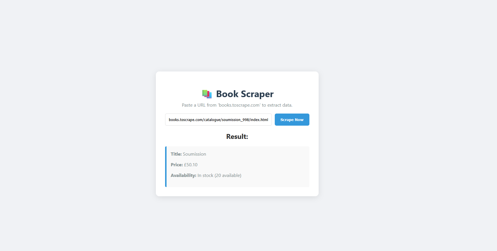

# 📚 Book Scraper API & Client


A Full Stack web scraping solution that extracts product data (title, price, and availability) from e-commerce sites. This project consists of a **Node.js/Express REST API** utilizing **Puppeteer** for headless browsing, and a responsive **Frontend** client to interact with the service.



## 🚀 Features

-   **Headless Scraping:** Uses Puppeteer to simulate a real browser, capable of rendering JavaScript-heavy websites.
-   **RESTful API:** Clean backend architecture with a dedicated endpoint for scraping.
-   **Input Validation:** Ensures valid URLs are processed.
-   **Responsive UI:** Modern, user-friendly interface with loading states and error handling.
-   **CORS Enabled:** Configured to allow secure communication between the frontend and backend.

## 🛠️ Tech Stack

**Backend:**
-   Node.js
-   Express.js
-   Puppeteer (Chromium Automation)

**Frontend:**
-   HTML5
-   CSS3 (Flexbox/Responsive)
-   Vanilla JavaScript (Fetch API)

## 📂 Project Structure

```bash
/scraper-api
│
├── node_modules/       # Dependencies
├── index.html          # Frontend Interface
├── style.css           # Styling
├── script.js           # Frontend Logic
├── server.js           # Backend API & Scraper Logic
├── package.json        # Project Manifest
└── README.md           # Documentation

⚡ Getting Started

Follow these steps to run the project locally.
Prerequisites

    Node.js (v14 or higher) installed on your machine.

Installation

    Clone the repository:
    Bash

git clone [https://github.com/vecelic/book-scraper-api.git](https://github.com/vecelic/book-scraper-api.git)
cd book-scraper-api

Install dependencies:
Bash

npm install

Start the Backend Server:
Bash

    node server.js

    The server will start at http://localhost:3000

    Run the Frontend:

        Simply open index.html in your web browser.

        Or use a live server extension (VS Code).

📖 Usage Guide

    Open the application in your browser.

    Paste a product URL from Books to Scrape (a sandbox site for testing scrapers).

        Example URL: http://books.toscrape.com/catalogue/a-light-in-the-attic_1000/index.html

    Click "Scrape Now".

    View the extracted Title, Price, and Availability status.

📡 API Documentation

If you want to use the backend programmatically:
POST /scrape

Extracts data from a given URL.

Request Body:
JSON

{
  "url": "[http://books.toscrape.com/catalogue/book-name/index.html](http://books.toscrape.com/catalogue/book-name/index.html)"
}

Success Response (200):
JSON

{
  "success": true,
  "data": {
    "title": "A Light in the Attic",
    "price": "£51.77",
    "availability": "In stock (22 available)"
  }
}

🤝 Contributing

Feel free to submit issues or pull requests. Suggestions for supporting more websites are welcome!

📝 License

This project is open-source and available under the MIT License.
